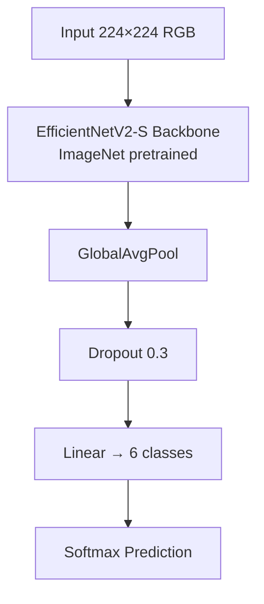
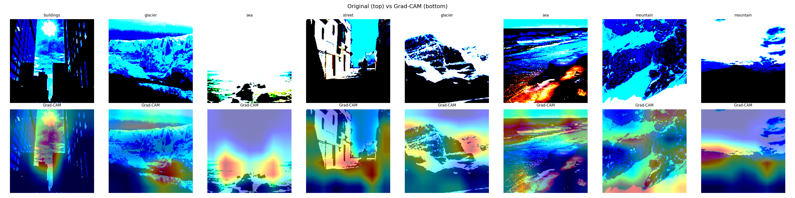

# Intel Image Classification — EfficientNetV2-S

Multi-class scene classification (6 categories) using EfficientNetV2-S with two-phase transfer learning from ImageNet weights.

---

## Architecture



ASCII fallback:

```
Input (3×224×224)
      │
      ▼
EfficientNetV2-S backbone  ← ImageNet weights
      │
   GlobalAvgPool
      │
   Dropout(0.3)
      │
   Linear(1280 → 6)
      │
   Prediction
```

---

## Classes

| ID | Class     |
|----|-----------|
| 0  | buildings |
| 1  | forest    |
| 2  | glacier   |
| 3  | mountain  |
| 4  | sea       |
| 5  | street    |

---

## Results

| Metric        | Value     |
|---------------|-----------|
| Top-1 Accuracy | 95%     |
| Top-5 Accuracy | 86%     |
| Parameters     | ~20.3 M  |
| Training time  | ~45 min (H100) |

> Results will be updated after training.

---

## Sample Grad-CAM Visualisations



*(Figure will be generated by `src/evaluate.py` after training.)*


## Setup

```bash
# 1. Clone the repository
git clonehttps://github.com/knownmax/intel-image-classification.git
cd intel-image-classification

# 2. Install dependencies
pip install -r requirements.txt

# 3. Download the dataset (requires Kaggle API credentials)
kaggle datasets download -d puneet6060/intel-image-classification
unzip intel-image-classification.zip -d data/intel-image-classification
# Ensure layout: data/intel-image-classification/{train,val,test}/class_name/
```

---

## Quickstart

```bash
# Train (reads from configs/train_config.yaml)
python src/train.py --config configs/train_config.yaml

# Evaluate and generate Grad-CAM
python src/evaluate.py --config configs/train_config.yaml
```

To override individual config values on the fly:

```bash
python src/train.py --config configs/train_config.yaml \
  data_dir=data/my_data batch_size=16
```

---

## Training Details

| Phase | Epochs | LR     | Backbone |
|-------|--------|--------|----------|
| 1     | 5      | 1e-3   | Frozen   |
| 2     | 15     | 1e-4   | Unfrozen |

- Optimizer: AdamW (weight_decay=1e-4)
- Scheduler: CosineAnnealingLR per phase
- Mixed precision: torch.cuda.amp (fp16)
- Label smoothing: 0.1

---

## Project Structure

```
image-classification/
├── README.md
├── requirements.txt
├── configs/
│   └── train_config.yaml
├── src/
│   ├── dataset.py      # DataLoaders + augmentation
│   ├── model.py        # EfficientNetV2-S + custom head
│   ├── train.py        # Two-phase training loop
│   └── evaluate.py     # Metrics, confusion matrix, Grad-CAM
├── notebooks/
│   └── inference_demo.ipynb
└── results/
    ├── best_model.pth          (generated)
    ├── confusion_matrix.png    (generated)
    └── gradcam_grid.png        (generated)
```
